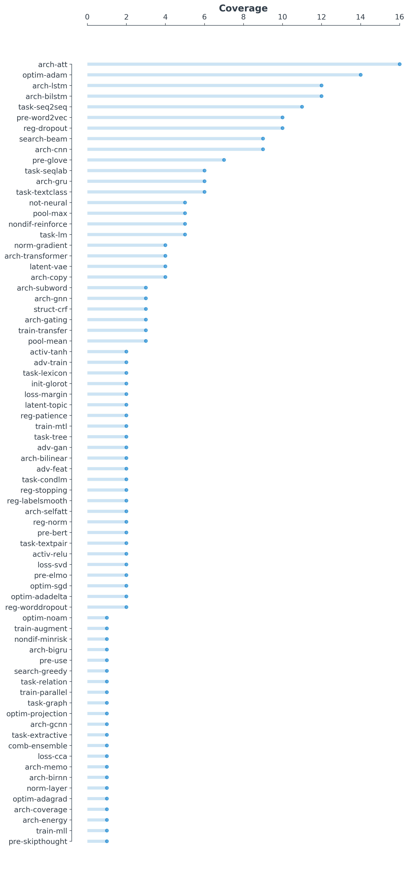
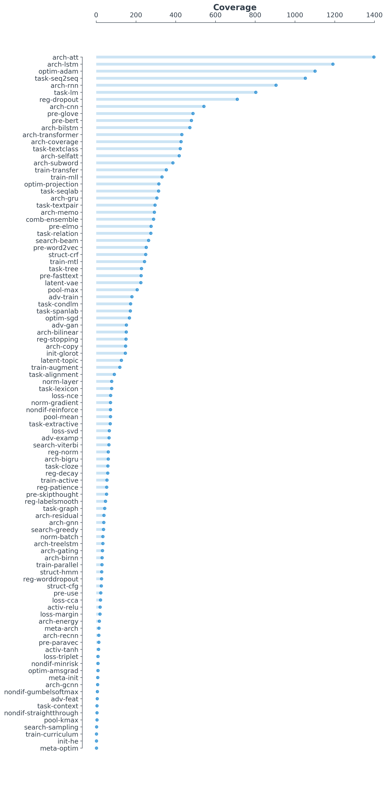

# Concepts in Neural Networks for NLP
by [Graham Neubig](http://phontron.com), [Pengfei Liu](http://pfliu.com), and other contributors

This is a repository that makes an attempt to empirically take stock of the **most important concepts necessary to
understand cutting-edge research in neural network models for NLP**. You look at two figures below, generated
automatically and through manual annotation, to see which of these topics are most common in current NLP research in
NLP (in recent papers in the [ACL anthology](http://aclanthology.info). See the [list of concepts](concepts.md)
to see a more complete description of what each of the tags below means, and also see below if you want to contribute
to the project, or want to figure out how to generate the graphs yourself.

Manually Annotated Concepts

Automatically Annotated Concepts (from ACL, EMNLP, and NAACL 2019)

## Contributing

There are several ways to contribute:
* **Perform annotation:** We could use more manual annotations of the concepts covered by papers, so please take a look
  below if you're interested in helping out in this regard.
* **Improve the code:** Check the "issues" section of the github repo, there are still several things that could be done
  to improve the functionality of the code.

## Setup

If you want to run the code here, first get the requirements:

    pip install -r requirements.txt

Also, install `poppler` through your favorite version control software.
    
Then download the ACL Anthology github repository:

    git clone https://github.com/acl-org/acl-anthology.git
    
## How to Perform Annotation

1. Read `concepts.md` to learn more about the concepts that are annotated here.
2. Run `get_paper.py` (directions below) to get a paper to annotate with the concepts contained therein.
3. When the paper is downloaded, a text file corresponding to the paper ID will be written out to `auto/ID.txt`. This
   will include some comments with the paper name, title, PDF location, etc. In addition, it will have some
   automatically provided concept tags that were estimated based on the article text.
4. Manually confirm that the automatically annotated concepts are correct. If so, then delete the comment saying
   "# CHECK: ". If the concepts are not included in the paper, then delete them.
5. Add any concepts that were not caught by the automatic process.
6. Once you are done annotating concepts, move `auto/ID.txt` to `annotations/ID.txt`. You can then send a pull request
   to the repository to contribute back.

**Examples Running `get_paper.py`**

Get random papers to annotate:
* 1: `python get_paper.py --years 18-19 --confs "P,N,D"  --n_sample 2 --template template.cpt --feature fulltext`
 
Get a specific paper to annotate:
* 2: `python get_paper.py --paper_id P19-1032 --template template.cpt --feature fulltext`

where:
* `paper_id`: it usually takes the form: P|N|D-1234. Moreover, once the `paper_id` has been specified, `years`,`confs`, and `n_sample` are not required.
* `confs`: a comma-separted list of conference abbreviations from which papers can be selected (P,N,D)
* `n_sample`: the number of sampled papers if paper_id is not specified
* `template`: the file of concept template (e.g. template.cpt)
* `feature`: which part of paper is used to classify (e.g. fulltext or title)

## Generating Aggregate Statistics/Charts

To generate bar charts like the ones above, you use `aggregate_tags.py` to calculate aggregate statistics, then
`draw_bar.py` to generate the bar chart.

If you want to do this for the hand-annotated concepts included in this library, you can run the following commands.

    python aggregate_tags.py annotations --concepts concepts.md > annotations.tsv
    python draw_bar.py --tsv annotations.tsv --fig annotations.png

If you want to do this for automatically-generated tags from some portion of the ACL anthology, you can run the
following command, which will download the papers from all the specified conferences (e.g. ACL, NAACL, and EMNLP from
2018 and 2019).

    python get_paper.py --years 18-19 --confs "P,N,D"  --n_sample all --template template.cpt --feature fulltext
    python aggregate_tags.py auto --concepts concepts.md > auto.tsv
    python draw_bar.py --tsv auto.tsv --fig auto.png

